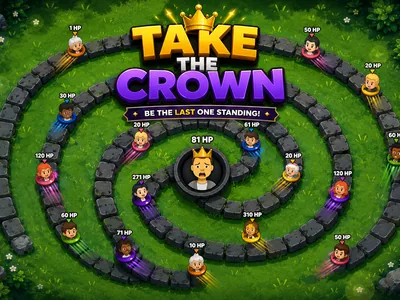

# Take the Crown - Interactive TikTok Live Game

> One throne, one very long line, and a crown that changes hands every few seconds.

One viewer sits on the throne and everyone else queues up in a long walled corridor to take it. When the head of the line reaches the throne the two HP numbers subtract, the bigger one survives with the difference, and the loser is out. The crown never sits still for long.

**[Play Take the Crown on Livecade](https://livecade.io/games/take-the-crown/?utm_source=github&utm_medium=readme&utm_campaign=take-the-crown)** - runs as a single browser source in OBS, Streamlabs, or TikTok LIVE Studio. Nothing for viewers to install.

## How viewers play

Viewers take part with the actions TikTok already gives them: **gifts**, **comments**, **likes**, **follows**, **shares**. Every action below is rebindable, so you decide which interaction drives which effect.

| Action | What it does |
| --- | --- |
| **Join the line** | Puts the viewer at the mouth of the corridor with their starting HP and their profile picture, and they walk in from there. Free, and bound to viewers entering the live by default so the line fills on its own |
| **Add HP** | Adds HP to the viewer who triggered it. In the line it tops them up where they stand, on the king it raises the throne, and on someone dead or new it spawns them at the back with that HP. Every trigger row carries its own amount and its own label, so one action covers a whole ladder of gifts |

## How it works

### The fight is one subtraction

The head of the line and the king cancel their HP against each other. The bigger number survives carrying the difference and the smaller one leaves the game, so a 50 HP viewer beats an 11 HP king and takes the throne on 39. Equal totals kill both and leave the seat open.

### HP carries over and never resets

Nothing is spent and nothing decays while a viewer is alive, so the throne is won by whoever accumulated the most. A viewer who joined on 1 HP can be worth thousands later, and topping up the current king raises the throne itself.

### The king thins the line himself

About once a second the king throws a guard wearing his own profile picture out along the corridor. Each one absorbs a single HP from the first viewer it meets and is spent, which costs the king nothing and clears out the 1 HP crowd before it arrives.

## About the game

One viewer sits on the throne and your whole chat forms a queue to take it off them. Viewers join free, appear at the mouth of a spiral corridor with their profile picture and HP over their head, and walk toward the centre. The corridor holds 164 of them shoulder to shoulder.

### The crown changes hands on one subtraction

When the viewer at the front arrives, the fight is pure subtraction. The two HP totals cancel and whoever had more survives carrying the difference, so an 11 HP king challenged by a 50 HP viewer loses the crown and the challenger sits down on 39. Equal totals knock both out and leave the seat empty for whoever arrives next.

### HP never resets, so spending compounds

HP never resets while a viewer is alive, so someone who arrived on 1 HP can be worth thousands an hour later. HP sent to the viewer already on the throne raises the throne itself, so your biggest supporter can be defended instead of just waiting to be knocked off, and HP sent to someone already knocked out puts them back at the end of the line rather than doing nothing.

## Gameplay

[Watch Take the Crown gameplay](https://cdn.livecade.io/games/take-the-crown.mp4)

## What you can configure

- **Camera** - Wide keeps the entire line on screen, close makes everyone bigger and lets the camera tour the corridor, still holds a fixed frame with no drift
- **Line speed** - How fast the queue walks, from a slow shuffle to a sprint. Sets how often the throne is challenged
- **Starting HP on join** - What a free joiner is worth when they enter the line, from 1 to 100

## FAQ

<strong>How do viewers play Take the Crown?</strong>

They join the line and walk toward the throne at the centre. When they reach it their HP is subtracted against the king's, and whoever has more survives with the difference and holds the crown. By default anyone entering the live is put in the line automatically, so viewers are playing before they do anything.

<strong>How does a viewer win a fight?</strong>

By having more HP than the king at the moment they arrive. The two totals cancel and the survivor keeps what is left over, so an 11 HP king who is challenged by a 50 HP viewer loses the throne and the challenger sits on 39. If both have exactly the same HP they knock each other out and the throne is empty for whoever comes next.

<strong>What happens when a viewer loses?</strong>

They are out of the game. Sending them HP puts them back at the end of the line with that HP, so a viewer is never locked out and a gift sent to someone already knocked out still does something visible.

<strong>Can the person on the throne be protected?</strong>

Yes. HP sent to the current king is added to the throne, so a viewer holding the crown can be reinforced by other people rather than just waiting to be knocked off. The king also throws out guards on his own, one about every second, and each absorbs one HP from the first challenger it meets.

<strong>How many viewers fit in the line?</strong>

The corridor holds 164 standing side by side, which is the real limit rather than a number we picked. If it is completely full a free join is skipped, but HP sent by a viewer who could not be seated is held and applied the moment a place opens, so a gift is never lost to a full line.

<strong>What can I bind gifts to?</strong>

There are two actions: joining the line and adding HP. Add HP carries its own amount on each trigger row, so one action covers an entire ladder, for example a follow worth 50, every 100 likes worth 10, and three gifts worth 10, 300 and 1000. That ladder ships already set up and every row is yours to change.

<strong>How do I add Take the Crown to my TikTok Live?</strong>

Add one browser source URL to OBS or your streaming software and go live. There is no plugin to install and nothing for your viewers to download.

## Setup

1. [Create a Livecade account](https://app.livecade.io/register?utm_source=github&utm_medium=cta&utm_campaign=take-the-crown)
2. Copy your overlay browser source URL
3. Paste it into OBS, Streamlabs, or TikTok LIVE Studio
4. Pick Take the Crown, set your triggers, and go live

Runs in the browser, so it works on Windows and macOS with nothing to download. [See all TikTok Live games](https://livecade.io/tiktok-live-games/?utm_source=github&utm_medium=readme&utm_campaign=take-the-crown).

---

_This repository documents Take the Crown, a hosted interactive game by [Livecade](https://livecade.io/?utm_source=github&utm_medium=footer&utm_campaign=take-the-crown). The game runs on Livecade's platform, so there is no source to install here._
